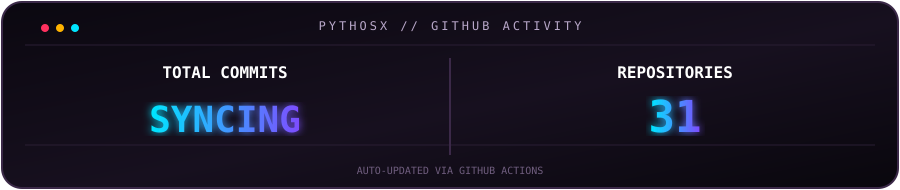

<div align="center">

# ⚡ PYTHOSX // VOID X

### `CODE • BUILD • AUTOMATE • INNOVATE`


<br>

[](https://t.me/PythosX)
[](https://github.com/PythosX)

<br>

> **"While others see problems, I see puzzles waiting to be solved — crafting elegant solutions one algorithm at a time."**

</div>

---

## `01 // SYSTEM STATUS`

<div align="center">

</div>

<p align="center">


</p>

---

## `02 // PROJECT MATRIX`

<div align="center">

### `// ALL PUBLIC REPOSITORIES • LIVE INDEX`

</div>

<!-- PROJECTS:START -->
<div align="center">
<table width="100%">
<tr>
<td width="50%" align="center">

### 🔒 Aether-Vault
Secure Python-based encrypted data storage and vault system.

<a href="https://github.com/PythosX/Aether-Vault"></a>

</td>
<td width="50%" align="center">

### 🤖 HyperTask AI
AI-powered productivity and reminder platform.

<a href="https://github.com/PythosX/HyperTask-AI"></a>

</td>
</tr>
</table>
</div>
<!-- PROJECTS:END -->

<p align="center">
<b>PROJECT MATRIX IS AUTO-REFRESHED BY GITHUB ACTIONS.</b><br>
<sub>New public repositories will appear here automatically.</sub>
</p>

---

## `03 // TECH ARSENAL`

<div align="center">


</div>

---

## `04 // DEVELOPMENT PROTOCOL`

```text
┌──────────────────────────────────────────────────────────────┐
│  INPUT        →  IDEA / PROBLEM / OBSERVATION                │
│  PROCESS      →  DESIGN / CODE / TEST / ITERATE              │
│  OUTPUT       →  TOOL / APP / AUTOMATION / SOLUTION          │
│                                                              │
│  [✓] BUILD   [✓] BREAK   [✓] DEBUG   [✓] REBUILD   [∞] REPEAT │
└──────────────────────────────────────────────────────────────┘
```

<div align="center">

### `// MISSION`

**Building tools that solve real problems and make life easier.**

<br>


### ⚡ `SYSTEM ONLINE` • `KEEP BUILDING` • `KEEP SHIPPING`

</div>
