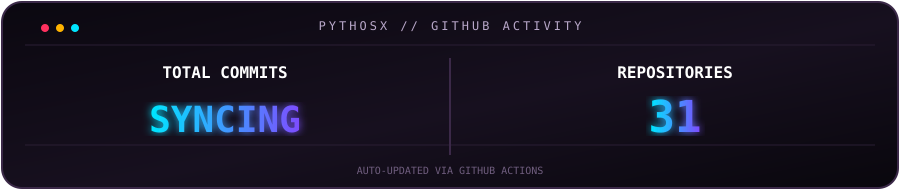
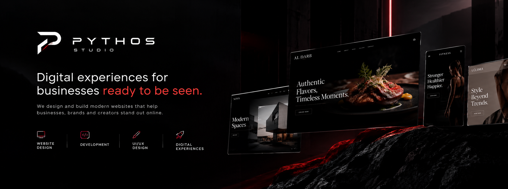

<div align="center">

# ⚡ PythosX 

### `DIGITAL BUILDER • CODE NINJA • SYSTEM EXPLORER`


<br>

[](https://www.linkedin.com/in/karan-ghorpade-36b7ab436)
[](https://t.me/PythosX)
[](mailto:contact.karanghorpade@gmail.com)
[](https://portfolio-v3-nu-gray.vercel.app/)

<br><br>


[](https://github.com/pythosx?tab=followers)


</div>

---

## `01 // SYSTEM STATUS`

<div align="center">

| ⚡ STATUS | 🧠 MODE | 🛠️ BUILD | 🌐 REALM |
|:---:|:---:|:---:|:---:|
| `ONLINE` | `BUILDING` | `ACTIVE` | `DIGITAL` |

</div>

> **"While others see problems, I see puzzles waiting to be solved — crafting elegant solutions one algorithm at a time."**

---

## `02 // GITHUB ACTIVITY`

<div align="center">



</div>

---

<h2 align="center">⚡ TECH ARSENAL // ACTIVE STACK</h2>

<p align="center">
  
  
  
  
  
</p>
<br>
<h3 align="center">Build Tools & Infrastructure</h3>
<p align="center">
  
  
  
  
  
  
  
</p>

---

<div align="center">

# ◢ PYTHOS STUDIO

### **Premium Websites • Digital Experiences • Creative Technology**



<br/>

### `YOUR BUSINESS DESERVES TO BE SEEN.`

<br/>

[](#)
[](https://github.com/PythosX)
[](#)

</div>

---

## ✦ THE IDEA

**Pythos Studio started with a simple belief:**

> ### **A great business deserves more than a basic website.**

There are businesses with great products, strong identities and stories worth telling — but their online presence doesn't communicate any of it.

**That's where Pythos Studio comes in.**

We transform a business's identity, products, personality and ambition into a **digital experience people remember.**

---

## ◈ NOT JUST WEBSITES

A website shouldn't feel like another template.

It should feel like **the business itself.**

| Business | Experience |
|---|---|
| 🍽️ Restaurant | Feel like stepping into the restaurant |
| 👗 Fashion Brand | Enter the world of the brand |
| 🏢 Business | Communicate trust instantly |
| 🎨 Creator | Reflect personality and creativity |
| 🛍️ Store | Turn products into an experience |

---

## ✦ WHAT WE CREATE

<div align="center">

| ◉ | ◉ | ◉ |
|---|---|---|
| **WEB DESIGN** | **UI / UX** | **DEVELOPMENT** |
| Distinctive interfaces | Purposeful experiences | Modern technology |
| **INTERACTION** | **STORYTELLING** | **PERFORMANCE** |
| Motion & micro-interactions | Brand-driven experiences | Fast & responsive |

</div>

---

## ◢ THE PYTHOS APPROACH

We don't begin with a template.

We begin with the **business**.

```text
     UNDERSTAND
          ↓
      DISCOVER
          ↓
       DESIGN
          ↓
        BUILD
          ↓
       REFINE
          ↓
       LAUNCH
          ↓
        GROW
```
---

## ✦ FROM THE FOUNDER

PythosX

Founder • Developer • Designer

I created Pythos Studio because I believe businesses already have something worth showing.

My job is to help bring that identity to the digital world.

Your business is already great.

Let's make the internet know..

---

<div align="center">


`PYTHOSX // VOID X` • `CODE IS THE INTERFACE`

</div>
